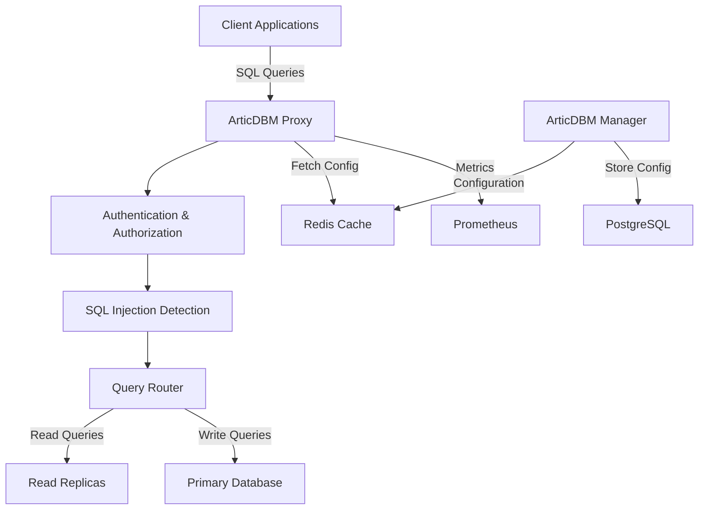

[](https://github.com/penguintechinc/articdbm) [](https://semver.org) [](https://www.gnu.org/licenses/agpl-3.0) [](https://hub.docker.com/r/articdbm/proxy) [](https://github.com/penguintechinc/articdbm)

```
:::'###::::'########::'########:'####::'######:::::'########::'########::'##::::'##:
::'## ##::: ##.... ##:... ##..::. ##::'##... ##:::: ##.... ##: ##.... ##: ###::'###:
:'##:. ##:: ##:::: ##:::: ##::::: ##:: ##:::..::::: ##:::: ##: ##:::: ##: ####'####:
'##:::. ##: ########::::: ##::::: ##:: ##:::::::::: ##:::: ##: ########:: ## ### ##:
 #########: ##.. ##:::::: ##::::: ##:: ##:::::::::: ##:::: ##: ##.... ##: ##. #: ##:
 ##.... ##: ##::. ##::::: ##::::: ##:: ##::: ##:::: ##:::: ##: ##:::: ##: ##:.:: ##:
 ##:::: ##: ##:::. ##:::: ##::::'####:. ######::::: ########:: ########:: ##:::: ##:
..:::::..::..:::::..:::::..:::::....:::......::::::........:::........:::..:::::..::
                                              
   Arctic Database Manager - Stay Cool Under Pressure
```

# 🧊 ArticDBM - Arctic Database Manager

**ArticDBM** is the world's first **XDP-accelerated enterprise database proxy** that delivers extreme performance while maintaining bank-grade security. Built for the modern cloud-native era, ArticDBM acts as an intelligent gateway between your applications and databases, offering kernel-level packet processing, AI-powered threat intelligence, and comprehensive multi-cloud management.

## 🚀 Revolutionary Performance - NEW v1.2.0

### ⚡ XDP/AF_XDP Kernel Acceleration
- **🎯 100M+ packets/second processing** at kernel level with eBPF/XDP programs
- **⚡ Sub-microsecond IP blocking** with zero userspace overhead
- **🔄 Zero-copy networking** via AF_XDP sockets for minimal CPU usage
- **🧠 NUMA-optimized architecture** with intelligent memory locality
- **📊 Real-time kernel statistics** with 65+ Prometheus metrics

### 🛡️ Advanced Security Intelligence
- **🤖 Automated Threat Intelligence**: Real-time feeds from STIX/TAXII, OpenIOC, MISP
- **🔒 Authorization-Validated Caching**: Secure query results with permission validation
- **🎯 ML-Powered Attack Detection**: Pattern recognition with confidence scoring
- **🚫 Intelligent Rate Limiting**: Token bucket algorithm with burst detection
- **📈 Adaptive Security**: Automatic rule updates based on threat landscape

### ☁️ Enterprise Multi-Cloud Management
- **🌐 Universal Cloud Abstraction**: AWS, GCP, Azure with unified API
- **⚖️ Intelligent Load Balancing**: Cost-aware, latency-optimized traffic distribution
- **🔄 Automatic Failover**: Health monitoring with seamless provider switching
- **📊 Aggregated Analytics**: Cross-cloud metrics and cost optimization
- **🎛️ Kubernetes Operator**: Native CRDs for GitOps deployment

### 🤖 AI-Driven Operations
- **🧠 Automated Performance Tuning**: ML-powered parameter optimization
- **📈 Predictive Scaling**: Trend analysis with confidence-based decisions
- **🔍 Query Optimization**: Intelligent routing and caching strategies
- **⚠️ Anomaly Detection**: Real-time pattern analysis for security threats

## 🌟 Key Features

### Core Database Management
- **🗄️ Multi-Database Support**: MySQL, PostgreSQL, MSSQL, MongoDB, and Redis
- **🔒 Advanced Security**: Kernel-level filtering, threat intelligence, fine-grained permissions
- **⚡ Extreme Performance**: XDP acceleration, zero-copy networking, intelligent caching
- **📊 Comprehensive Monitoring**: 65+ metrics, distributed tracing, real-time dashboards

### Enterprise Features
- **🔄 High Availability**: Blue/green deployments, cluster synchronization, disaster recovery
- **☁️ Cloud Native**: Kubernetes operator, multi-cloud support, auto-scaling
- **🏢 MSP Ready**: Multi-tenant architecture, usage-based billing, white-label support
- **🛡️ Bank-Grade Security**: End-to-end encryption, compliance reporting, audit trails

## 🚀 Quick Start

```bash
# Clone the repository
git clone https://github.com/penguintechinc/articdbm.git
cd articdbm

# Start all services
docker-compose up -d

# Access the management interface
open http://localhost:8000

# Connect through the proxy
mysql -h localhost -P 3306 -u your_user -p
psql -h localhost -p 5432 -U your_user -d your_database
```

## 🏗️ Architecture Overview

ArticDBM consists of two main components:

- **Proxy**: High-performance Go-based database proxy with protocol support for multiple databases
- **Manager**: Python-based web interface for configuration, user management, and monitoring



## 🛠️ Components

### ArticDBM Proxy
- Written in Go for maximum performance
- Handles database protocol translation
- Performs security checks and routing
- Maintains connection pools

### ArticDBM Manager
- Built with py4web framework
- Web-based configuration interface
- User and permission management
- Real-time configuration updates

## 📦 Supported Databases

| Database | Version | Protocol Support | Features |
|----------|---------|-----------------|----------|
| MySQL | 5.7+ | Native MySQL | Full support |
| PostgreSQL | 11+ | Native PostgreSQL | Full support |
| MSSQL | 2017+ | TDS Protocol | Full support |
| MongoDB | 4.0+ | MongoDB Wire | Full support |
| Redis | 5.0+ | RESP Protocol | Full support |

## 🔒 Security Features

- **SQL Injection Detection**: Pattern-based analysis with 14+ common attack vectors
- **Threat Intelligence Integration**: STIX/TAXII, OpenIOC, and MISP feed support for blocking known threats
- **Per-Database Security Policies**: Configure security settings individually for each database
- **Fine-grained Permissions**: Database and table-level access control
- **Audit Logging**: Complete query and access trail with threat match recording
- **TLS Support**: Encrypted connections to backends
- **Authentication Caching**: Redis-based performance optimization

## ☁️ Cloud Database Management (v1.1.0+)

### Multi-Cloud Provisioning
ArticDBM can now provision and manage databases across multiple cloud providers:

#### Kubernetes Integration
```bash
# Create cloud provider configuration
curl -X POST http://localhost:8000/api/cloud-providers \
  -H "Content-Type: application/json" \
  -d '{
    "name": "production-k8s",
    "provider_type": "kubernetes",
    "configuration": {
      "namespace": "databases"
    },
    "credentials_path": "/path/to/kubeconfig"
  }'

# Deploy a PostgreSQL database
curl -X POST http://localhost:8000/api/cloud-instances \
  -H "Content-Type: application/json" \
  -d '{
    "name": "app-postgres",
    "provider_id": 1,
    "instance_type": "postgresql",
    "instance_class": "medium"
  }'
```

#### AWS RDS Integration
```bash
# Configure AWS provider
curl -X POST http://localhost:8000/api/cloud-providers \
  -H "Content-Type: application/json" \
  -d '{
    "name": "production-aws",
    "provider_type": "aws",
    "configuration": {
      "region": "us-east-1",
      "vpc_id": "vpc-12345",
      "subnet_group": "articdbm-subnet-group"
    },
    "credentials_path": "/path/to/aws-creds.json"
  }'

# Create RDS instance with auto-scaling
curl -X POST http://localhost:8000/api/cloud-instances \
  -H "Content-Type: application/json" \
  -d '{
    "name": "production-mysql",
    "provider_id": 2,
    "instance_type": "mysql",
    "instance_class": "db.t3.medium",
    "storage_size": 100,
    "multi_az": true,
    "auto_scaling_enabled": true
  }'
```

### AI-Powered Scaling
```bash
# Configure intelligent scaling policy
curl -X POST http://localhost:8000/api/scaling-policies \
  -H "Content-Type: application/json" \
  -d '{
    "cloud_instance_id": 1,
    "metric_type": "cpu",
    "scale_up_threshold": 80.0,
    "scale_down_threshold": 20.0,
    "ai_enabled": true,
    "ai_model": "openai"
  }'

# Trigger AI scaling recommendation
curl -X POST http://localhost:8000/api/cloud-instances/1/scale \
  -H "Content-Type: application/json" \
  -d '{
    "action": "scale_up",
    "ai_enabled": true
  }'
```

### Real-time Monitoring
- **Cloud Metrics Integration**: Automatic collection from AWS CloudWatch, GCP Monitoring, K8s Metrics Server
- **Scaling Event Tracking**: Complete audit trail of all scaling operations
- **Performance Analytics**: Historical data analysis for optimization recommendations

## 🌐 Deployment Options

### Docker Compose (Recommended for Development)
```bash
docker-compose up -d
```

### Kubernetes
```yaml
apiVersion: apps/v1
kind: Deployment
metadata:
  name: articdbm-proxy
spec:
  replicas: 3
  template:
    spec:
      containers:
      - name: proxy
        image: articdbm/proxy:1.0.0
        ports:
        - containerPort: 3306
        - containerPort: 5432
```

### Cloud Deployment
- **AWS**: ECS, EKS with RDS backends
- **GCP**: GKE with Cloud SQL backends
- **Azure**: AKS with Azure Database backends

## 📚 Documentation

**📖 Complete Documentation**: [docs.articdbm.penguintech.io](https://docs.articdbm.penguintech.io)

- [📘 **Usage Guide**](docs/USAGE.md) - Complete setup and configuration
- [🏗️ **Architecture**](docs/ARCHITECTURE.md) - System design and components  
- [🚀 **Kubernetes Deployment**](docs/KUBERNETES.md) - Production deployment guide
- [☁️ **Cloudflare Setup**](docs/CLOUDFLARE-SETUP.md) - Web hosting and CDN configuration
- [📝 **Release Notes**](docs/RELEASE-NOTES.md) - Version history and changes
- [🤝 **Contributing**](docs/CONTRIBUTING.md) - How to contribute
- [⚖️ **License**](docs/LICENSE.md) - AGPL v3 license

## 🔗 Links

- [GitHub Repository](https://github.com/penguintechinc/articdbm)
- [Docker Hub](https://hub.docker.com/r/articdbm/proxy)
- [Website](https://articdbm.penguintech.io)

## 💡 Getting Help

- Check our [Usage Guide](docs/USAGE.md) for detailed instructions
- Review [Architecture Guide](docs/ARCHITECTURE.md) for system design details
- Browse full documentation at [docs.articdbm.penguintech.io](https://docs.articdbm.penguintech.io)
- Submit issues on [GitHub](https://github.com/penguintechinc/articdbm/issues)

## 💻 Example Usage

### Basic Connection
```python
import pymysql

# Connect through ArticDBM proxy
connection = pymysql.connect(
    host='localhost',
    port=3306,
    user='your_user',
    password='your_password',
    database='your_database'
)

# Your queries go through ArticDBM's security and routing
cursor.execute("SELECT * FROM users WHERE active = 1")
```

### Configuration via API
```bash
# Add a database backend
curl -X POST http://localhost:8000/api/servers \
  -H "Content-Type: application/json" \
  -d '{
    "name": "primary-mysql",
    "type": "mysql",
    "host": "mysql.example.com",
    "port": 3306,
    "role": "write"
  }'
```

## 🎯 Use Cases

- **Database Security Gateway**: Centralized security for multiple databases
- **Multi-tenant Applications**: Isolated database access per tenant
- **Legacy Application Modernization**: Add security without code changes
- **Database Load Balancing**: Distribute read/write operations
- **Audit and Compliance**: Complete database access logging

## 🤝 Contributing

We welcome contributions! Please see our [Contributing Guide](docs/CONTRIBUTING.md) for details on:

- Code style and standards
- Development environment setup
- Testing procedures
- Pull request process

## 📊 Performance

- **Latency Overhead**: < 1ms additional latency per query
- **Throughput**: Up to 100K queries/second per proxy instance
- **Connection Pooling**: Reduces backend connections by 10-50x
- **Memory Usage**: < 100MB base memory footprint

## 🆘 Support

- **Documentation**: [docs.articdbm.penguintech.io](https://docs.articdbm.penguintech.io)
- **Website**: [articdbm.penguintech.io](https://articdbm.penguintech.io)
- **Issues**: [GitHub Issues](https://github.com/penguintechinc/articdbm/issues)
- **Discussions**: [GitHub Discussions](https://github.com/penguintechinc/articdbm/discussions)

## ⚖️ License

ArticDBM is licensed under the [GNU Affero General Public License v3.0](docs/LICENSE.md) (AGPL-3.0). This ensures the project remains open source while allowing commercial use with certain obligations.

**License Highlights:**
- **Personal & Internal Use**: Free under AGPL-3.0
- **Commercial Use**: Requires commercial license
- **SaaS Deployment**: Requires commercial license if providing as a service

### Contributor Employer Exception (GPL-2.0 Grant)

Companies employing official contributors receive GPL-2.0 access to community features:

- **Perpetual for Contributed Versions**: GPL-2.0 rights to versions where the employee contributed remain valid permanently, even after the employee leaves the company
- **Attribution Required**: Employee must be credited in CONTRIBUTORS, AUTHORS, commit history, or release notes
- **Future Versions**: New versions released after employment ends require standard licensing
- **Community Only**: Enterprise features still require a commercial license

This exception rewards contributors by providing lasting fair use rights to their employers.

## 🏷️ Tags

`database-proxy` `security` `mysql` `postgresql` `mongodb` `redis` `mssql` `golang` `python` `docker` `kubernetes` `sql-injection` `authentication` `authorization` `monitoring` `high-availability`

---

**ArticDBM - Keep Your Databases Cool Under Pressure** ❄️

*Made with ❤️ for the developer community*
